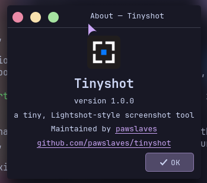

<div align="center">

# Tinyshot

**A tiny, Lightshot-style screenshot tool for Linux.**

[](LICENSE)
[](https://github.com/pawslaves/tinyshot/commits/main)
[](https://github.com/pawslaves/tinyshot/stargazers)
<br>


<br><br>


</div>

---

Press Print, drag a rectangle, scribble on it, then copy, save or print it. Written
in C++20 and Qt 6; works on Wayland and X11.

Inspired by Lightshot. Not affiliated with Skillbrains.

## Features

- Tray icon with a small, familiar menu
- Region selection with a dimmed backdrop, size label, resize handles,
  arrow-key nudging, and Ctrl+drag to select and copy in one go
- Pen, line, arrow, rectangle, marker and text tools, with color picker and undo
- Copy, save (PNG, JPEG or BMP) and print
- Global hotkeys: Print to capture, Shift+Print to save the whole screen
- Optional, off by default: upload to prnt.sc (Ctrl+D, Ctrl+Print), the share
  buttons, Google reverse image search and the prntscr.com account; the switch
  for them is in Options → General

## Installing

Grab a package from the [latest release](https://github.com/pawslaves/tinyshot/releases/latest).

**Debian 13, Ubuntu 25.04 or newer** — the `.deb`:

```sh
sudo apt install ./tinyshot_1.0.0_amd64.deb
```

It's built against Qt 6.8, so older releases (like Ubuntu 24.04) should use the
Flatpak or build from source.

**Any distro** — the `.flatpak` bundle:

```sh
flatpak install --user ./tinyshot.flatpak
```

It pulls in the KDE runtime from Flathub the first time. The sandbox only gets what
Tinyshot needs: the network (for uploads, which are off until you enable them), the
tray and notifications, `~/Pictures/Tinyshot`, and the printer.

Either way, Tinyshot shows up in your app menu. Start it from there so your desktop
recognizes it properly.

## Building from source

On Debian 13 or Ubuntu 25.04+:

```sh
sudo apt install g++ cmake ninja-build qt6-base-dev qt6-tools-dev qt6-svg-plugins \
  libx11-dev libxfixes-dev
```

Ubuntu 24.04 works too (Qt 6.3 is the minimum), but ships the SVG plugin as
`libqt6svg6` instead of `qt6-svg-plugins`.

- `qt6-tools-dev` brings the Qt Linguist tools that the translation step needs.
- The SVG plugin is needed at runtime: the icons and the toolbar artwork are SVG.
- `libx11-dev` and `libxfixes-dev` are optional. They enable the X11 hotkey
  fallback and drawing the cursor into X11 captures.
- On Wayland you need `xdg-desktop-portal` plus your desktop's backend
  (`xdg-desktop-portal-kde`, `xdg-desktop-portal-gtk`, …).

```sh
cmake -S . -B build -G Ninja -DBUILD_TESTING=ON
cmake --build build
ctest --test-dir build
./build/tinyshot
```

To install your build into `~/.local` (no root needed):

```sh
scripts/install.sh
scripts/uninstall.sh
```

Both take `--prefix` if you want somewhere else. The uninstall script removes exactly
what the install script put there, and nothing else.

To build the packages yourself:

```sh
cmake --build build --target package     # .deb, needs dpkg-dev and file

flatpak install --user flathub org.flatpak.Builder
flatpak run org.flatpak.Builder --user --force-clean --install-deps-from=flathub \
  --repo=build-repo build-flatpak packaging/flatpak/io.github.pawslaves.Tinyshot.yml
flatpak build-bundle --runtime-repo=https://flathub.org/repo/flathub.flatpakrepo \
  build-repo tinyshot.flatpak io.github.pawslaves.Tinyshot
```

Translations live in `translations/`, in Qt's `.ts` format. English is the source
language; add a language as `translations/tinyshot_<code>.ts` and it's picked up
automatically. After changing a string, refresh them with
`cmake --build build --target update_translations`.

## Wayland notes

- Screenshots go through the xdg-desktop-portal. The first time, your desktop may ask
  you to allow it.
- Hotkeys are registered through the portal too, and show up in your desktop's
  shortcut settings (on KDE: System Settings → Shortcuts → Tinyshot). If a key is
  already taken — Spectacle likes to own Print — it's left unassigned, and you can
  set it there.
- The portal doesn't include the mouse cursor in screenshots, and Wayland doesn't
  tell apps where monitors are, so a selection stays on the monitor you started
  dragging on.

## X11 notes

- Screens are captured directly, so it's instant.
- Hotkeys still use the portal when one is running. Otherwise Tinyshot grabs the
  keys itself, and shows a notification if another app already has one.
- The "capture cursor" option works here.

## Settings

Settings live in `~/.config/tinyshot/tinyshot.ini`. Delete it to start fresh.

## License

GPL-3.0-or-later. See [LICENSE](LICENSE).
